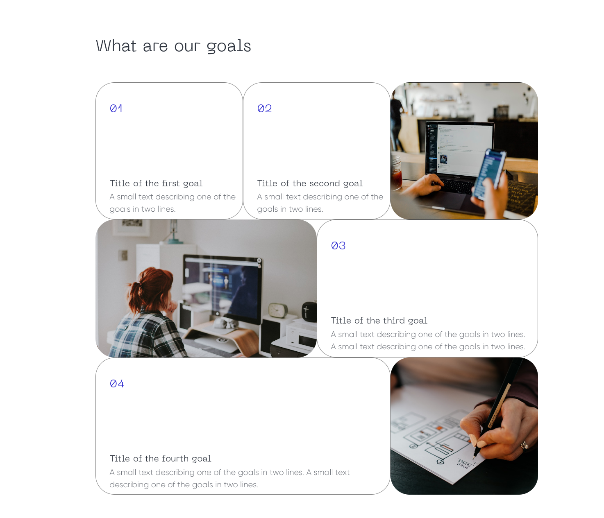
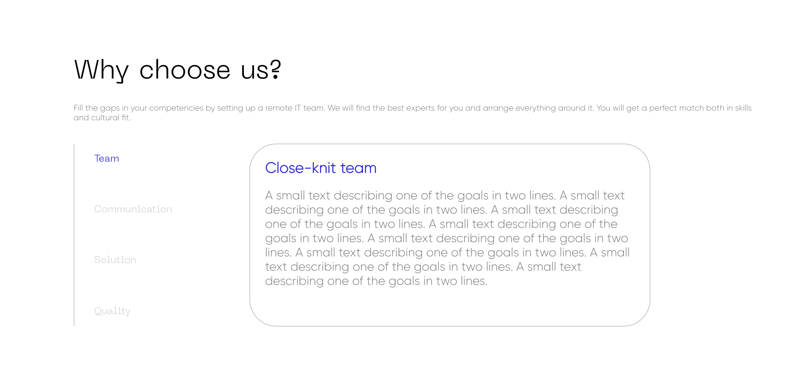
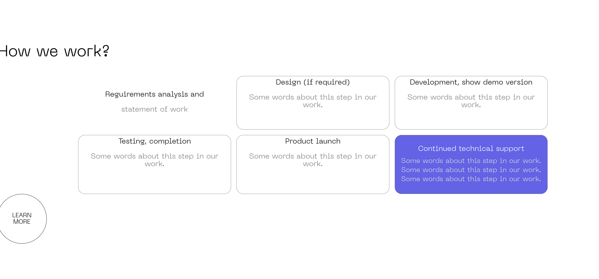
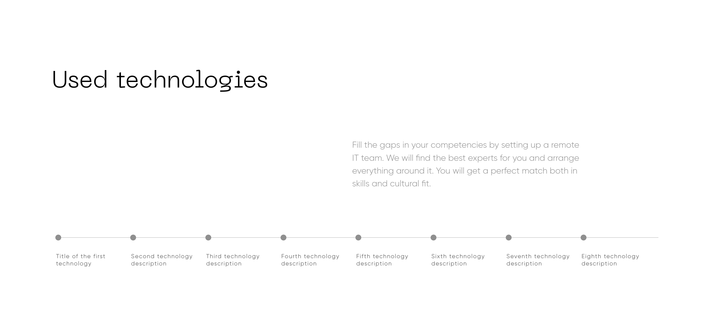
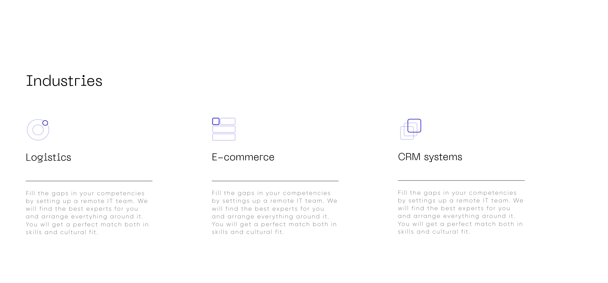
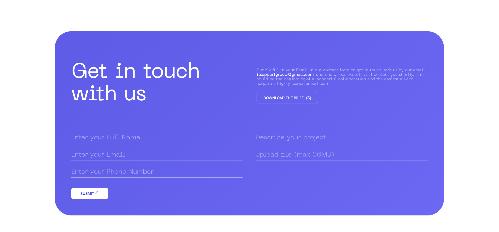
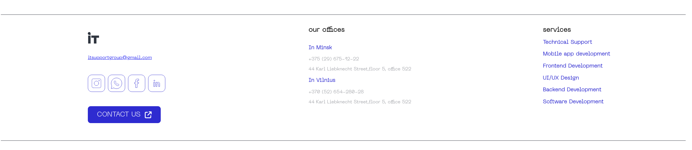
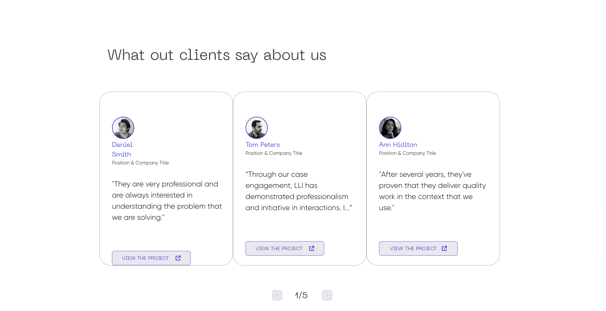

# Cepelinai – Pavasarinis projektas

## Apie projektą

**Cepelinai** – tai internetinė svetainė, sukurta vykdant **Pavasarinį projektą** mokymo įstaigoje **TECHIN**.

Projektas buvo kuriamas pagal pateiktą **Figma** dizaino šabloną. Mūsų užduotis buvo šį dizainą paversti veikiančia ir interaktyvia interneto svetaine, dirbant komandoje bei naudojant profesionalius programinės įrangos kūrimo įrankius.

Projektą vykdėme **vieną mėnesį**, dirbdami **dvi darbo dienas per savaitę nuo 9:00 iki 14:30**. Per šį laikotarpį planavome darbus, skirstėmės užduotis, kūrėme svetainę ir mokėmės dirbti komandoje naudojant šiuolaikinius programavimo įrankius.

## Naudoti įrankiai

* Figma
* Jira
* Git ir GitHub

## Projekto tikslai

* Pritaikyti pateiktą Figma dizainą veikiančiai interneto svetainei.
* Išmokti dirbti komandoje kuriant bendrą projektą.
* Įgyti praktinės patirties naudojant Git ir GitHub.
* Susipažinti su užduočių planavimu naudojant Jira.
* Tobulinti „Frontend“ programavimo įgūdžius.
* Suprasti programinės įrangos kūrimo proceso etapus – nuo planavimo iki galutinio rezultato.

## Komandos nariai

* **Karolis Beliavskij** – komandos vadovas (Team Lead), kūrė: „**Header**“, „**What Are Our Goals?**“
* **Lukas Bludnickas** – programuotojas (Developer), kūrė: „**Navigation Bar**“, „**Why Choose Us?**“
* **Edgaras Stimburys** – programuotojas (Developer), kūrė: „**Footer**“, „**Get in Touch With Us**“
* **Ignas Tikanov** – programuotojas (Developer), kūrė: „**Industries**“, „**Used Technologies**“
* **Nojus Vaitonis** – programuotojas (Developer), kūrė: „**How We Work?**“
* **Rokas Ilgarūbis** – programuotojas (Developer), kūrė: „**Who We Are?**“, „**Our Team**“, „**IT Support Group Through the Years**“, „**What Our Clients Say About Us**“
 

## Ekrano nuotraukos

Paspauskite čia norėdami peržiūrėti, kaip atrodo svetaine

 

